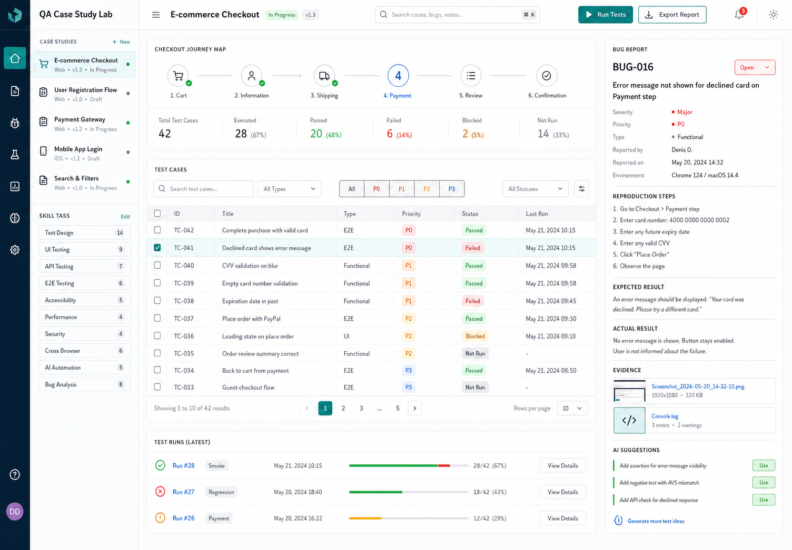

# QA Case Study Lab

QA Case Study Lab is a portfolio dashboard for demonstrating practical QA, bug analysis, risk-based testing, and AI-assisted test design.

The app presents a realistic e-commerce checkout case study: journey map, test case table, priority/status filters, latest test runs, selected bug report, evidence notes, AI-generated suggestions, and a markdown report preview.



## Why This Project Helps

Hiring managers can quickly see that the candidate understands:

- test case design and prioritization
- P0/P1 risk thinking
- defect reporting with reproduction steps
- expected vs actual result writing
- evidence-driven QA work
- regression and smoke test runs
- small AI-assisted workflow ideas
- React, TypeScript, component state, filtering, tests, and CI

## Features

- Interactive checkout QA dashboard
- Case study navigation and skill tags
- Journey map for checkout steps
- Test case table with priority and status filtering
- Search across test IDs, titles, status, type, stage, and owner
- Bug report inspector with metadata, steps, evidence, expected result, and actual result
- AI suggestion panel with adoptable actions
- Simulated focused test runs
- Markdown report preview
- Unit and UI tests with Vitest and Testing Library
- GitHub Actions CI workflow

## Tech Stack

- React
- TypeScript
- Vite
- Vitest
- Testing Library
- Playwright
- Oxlint
- Lucide React

## Getting Started

Install dependencies:

```bash
npm install
```

Run the app:

```bash
npm run dev
```

Open:

```text
http://localhost:5173
```

## Scripts

```bash
npm run dev
npm run lint
npm run typecheck
npm run test
npm run test:e2e
npm run build
npm run check
```

## Project Structure

```text
.github/workflows/ci.yml       GitHub Actions verification workflow
docs/
  bug-report-template.md       Reusable bug report template
  design-concept.png           Original UI concept used for implementation
  test-plan.md                 Manual QA test plan
src/
  App.tsx                      Main application composition and UI states
  App.css                      Product dashboard design system
  App.test.tsx                 Render and interaction tests
  data.ts                      Case study, test case, run, and bug data
  qa.ts                        Filtering, summary, risk, report, and suggestion logic
  qa.test.ts                   Domain logic tests
  types.ts                     Shared TypeScript types
e2e/
  dashboard.spec.ts            Playwright smoke and responsive checks
```

## Quality Notes

- `npm run check` runs lint, typecheck, unit tests, e2e smoke tests, and build.
- The dashboard is data-driven from typed fixtures.
- QA metrics are calculated from test case status data rather than hardcoded in the UI.
- AI suggestions are deterministic and testable, so the project works without an API key.
- The design concept is included to show product/design process, not only code.

## CV Description

QA Case Study Lab - built a React and TypeScript portfolio dashboard for an e-commerce checkout QA case study. Implemented risk-based test filtering, calculated QA metrics, bug report inspection, simulated test runs, deterministic AI test suggestions, unit tests, Playwright smoke tests, manual QA docs, and CI.

## Next Improvements

- Add import/export for real test case CSV files.
- Add a second case study with API-focused bug evidence.
- Deploy a live demo and add the URL here.
