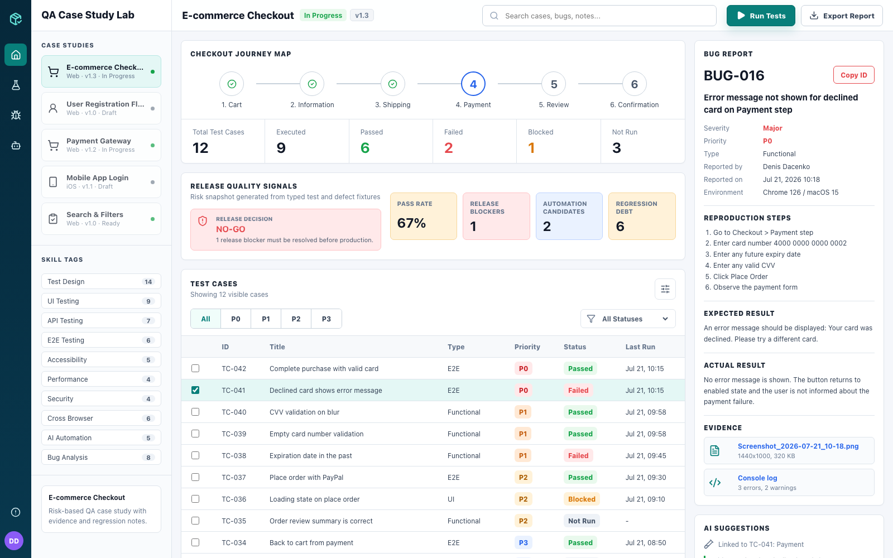
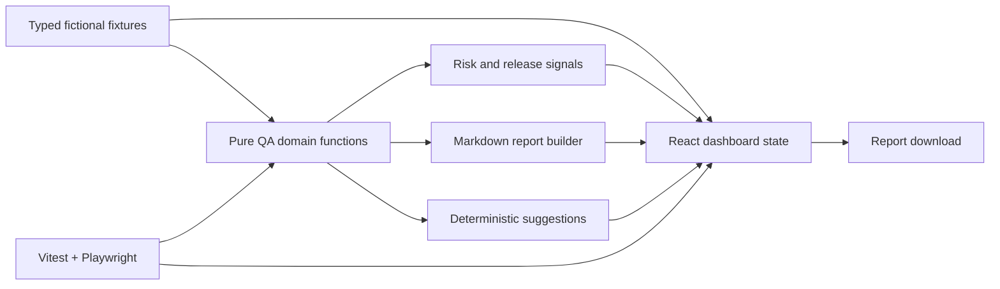

# QA Case Study Lab

A deployed React portfolio case study for manual, risk-based, and evidence-driven QA decision-making.

[](https://github.com/madara66613/qa-case-study-lab/actions/workflows/ci.yml)
[](https://github.com/madara66613/qa-case-study-lab/actions/workflows/deploy-pages.yml)

[Open the live demo](https://madara66613.github.io/qa-case-study-lab/) · [Read the test plan](docs/test-plan.md) · [Use the bug-report template](docs/bug-report-template.md)



> The checkout product, test runs, defects, people, environments, and evidence metadata are fictional seed data created for this portfolio case study. They do not represent work for a real company or a production release.

## Problem

QA portfolios often list tools without showing how a tester prioritizes risk, explains a release decision, connects defects to test coverage, or communicates evidence. This project turns those decisions into an interactive, reviewable case study.

## Implemented Features

- Typed checkout test inventory with P0-P3 priority, execution status, stage, owner, and last-run context.
- Search plus priority and status filtering.
- Risk sorting and release signals derived from the current test and defect data.
- Explainable `GO`, `CONDITIONAL`, or `NO-GO` recommendation.
- Linked defect inspector with steps, expected/actual results, environment, and evidence notes.
- Simulated focused smoke/regression runs for exploring reporting behavior.
- Deterministic AI-style regression suggestions that can be adopted into the report.
- Markdown report preview and browser download.
- Responsive, accessible interface with desktop and mobile checks.
- Unit/UI tests, Playwright smoke tests, CI, and GitHub Pages deployment.

## Technical Stack

- React 19 and TypeScript
- Vite
- Vitest and Testing Library
- Playwright
- Oxlint
- Lucide React
- GitHub Actions and GitHub Pages

## Architecture



Metrics and release decisions are calculated from typed fixtures rather than hardcoded display values. The browser's **Run Tests** action simulates a new run record; it does not execute the repository's Playwright suite from the deployed page.

## Testing and Quality

`npm run check` runs:

1. Oxlint
2. TypeScript project validation
3. Vitest unit and component tests
4. Playwright desktop and mobile smoke checks
5. Production build

Playwright verifies the rendered dashboard, filtering and focused-run behavior, linked-defect/report export flow, and page-level mobile overflow. The same verification chain runs in CI.

## Local Setup

Requirements: Node.js 22 and npm.

```bash
git clone https://github.com/madara66613/qa-case-study-lab.git
cd qa-case-study-lab
npm install
npm run dev
```

Open [http://localhost:5173](http://localhost:5173).

## Available Commands

| Command | Purpose |
| --- | --- |
| `npm run dev` | Start the Vite development server |
| `npm run lint` | Run Oxlint |
| `npm run typecheck` | Validate the TypeScript projects |
| `npm run test` | Run Vitest |
| `npm run test:e2e` | Run Playwright smoke/responsive checks |
| `npm run build` | Create the production bundle |
| `npm run check` | Run the full local/CI verification chain |

## Project Structure

```text
.github/workflows/
  ci.yml                       Full verification
  deploy-pages.yml             GitHub Pages deployment
docs/
  bug-report-template.md       Reusable defect template
  design-concept.png           Original interface concept
  test-plan.md                 Manual QA cases
e2e/
  dashboard.spec.ts            Playwright journeys and responsive checks
output/playwright/
  qa-case-study-dashboard.png  Verified desktop screenshot
src/
  data.ts                      Fictional case, test, run, and defect fixtures
  qa.ts                        Risk, filtering, release, reporting, suggestions
  App.tsx                      Interactive dashboard
  *.test.ts(x)                 Unit and component coverage
```

## Key Engineering Decisions

- **Risk before decoration:** the main output is an explainable release recommendation, not a static metrics dashboard.
- **Traceable defects:** each defect is linked to a specific test case and expected/actual behavior.
- **Deterministic suggestions:** AI-style ideas remain reviewable and testable without an external model or API key.
- **Seeded case study:** fictional data makes the scope safe to publish and repeat while avoiding claims about commercial work.
- **Separate product and test actions:** simulated runs demonstrate UI/reporting state; repository tests remain real CLI/CI checks.

## Known Limitations

- The checkout system and all displayed execution evidence are fictional; the app does not connect to a real product or test environment.
- Evidence filenames, console counts, and network notes are illustrative metadata. The referenced defect screenshots/logs are not committed artifacts.
- **Run Tests** creates a deterministic simulated run and does not launch Playwright in the browser.
- AI suggestions are rule-based, not generated by a live model.
- There is no backend, authentication, persistence, issue-tracker integration, or collaborative workflow.
- The interface has targeted accessibility checks but has not undergone a formal WCAG audit.

## Roadmap

- Attach committed, anonymized evidence artifacts to each fictional defect.
- Import test results from a machine-readable fixture instead of only seeded TypeScript data.
- Add automated accessibility scanning and keyboard-flow coverage.
- Add report versioning and optional local persistence.

## Recruiter Demo Flow

1. Search for `PayPal` and run the focused set.
2. Select `Expiration date in the past` and inspect the linked defect.
3. Compare the release signals with the displayed `NO-GO` explanation.
4. Adopt a regression suggestion and export the Markdown report.
5. Open the repository test plan and Playwright spec to separate manual design from automation.

## CV-Ready Description

Built and deployed a React/TypeScript QA case-study dashboard with risk-based test design, linked defect analysis, explainable release decisions, report export, deterministic regression suggestions, Vitest coverage, Playwright smoke tests, CI, and GitHub Pages deployment.

## License

No open-source license has been added. The source is public for portfolio review; normal copyright restrictions apply.
